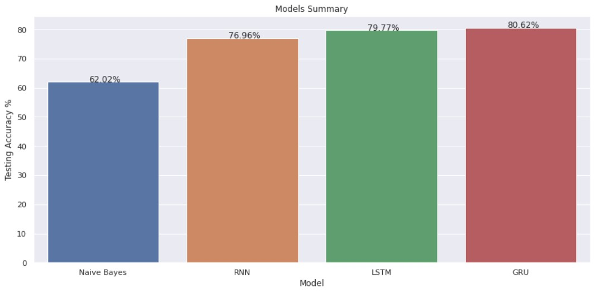

# Financial Sentiment Analysis - [Kaggle Dataset](https://www.kaggle.com/datasets/sbhatti/financial-sentiment-analysis)

## About Dataset
### Data
The following data is intended for advancing financial sentiment analysis research. It's two datasets (FiQA, Financial PhraseBank) combined into one easy-to-use CSV file. It provides financial sentences with sentiment labels.

### Citations
Malo, Pekka, et al. "Good debt or bad debt: Detecting semantic orientations in economic texts." Journal of the Association for Information Science and Technology 65.4 (2014): 782-796.

## My Work
In this notebook I did Financial Sentiment Analysis by using different models
- First, Classification Models: Naive Bayes Classification Model
- Then, Sequential Models: RNN, LSTM, GRU

By the end of the notebook there's a comparison between results of each model

### Steps:
I. Reading Data: using pandas

II. Preprocessing Data: using re, nltk , stopwords packages and finally make the data balanced

III. Classifier Model: using **CountVectorizer** class from sickit-learn package to convert word2vec, then split data into train and test, next fit the **Naive Bayes** model with data, and finally Evaluate the Model

IV. Sequential Model: I used 3 differnet sequential models such as **RNN**, **LSTM**, and **GRU**

## Results

As shown, GRU and LSTM got the highest accuracy score